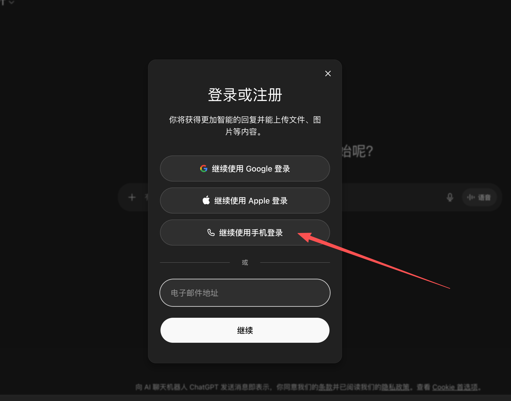
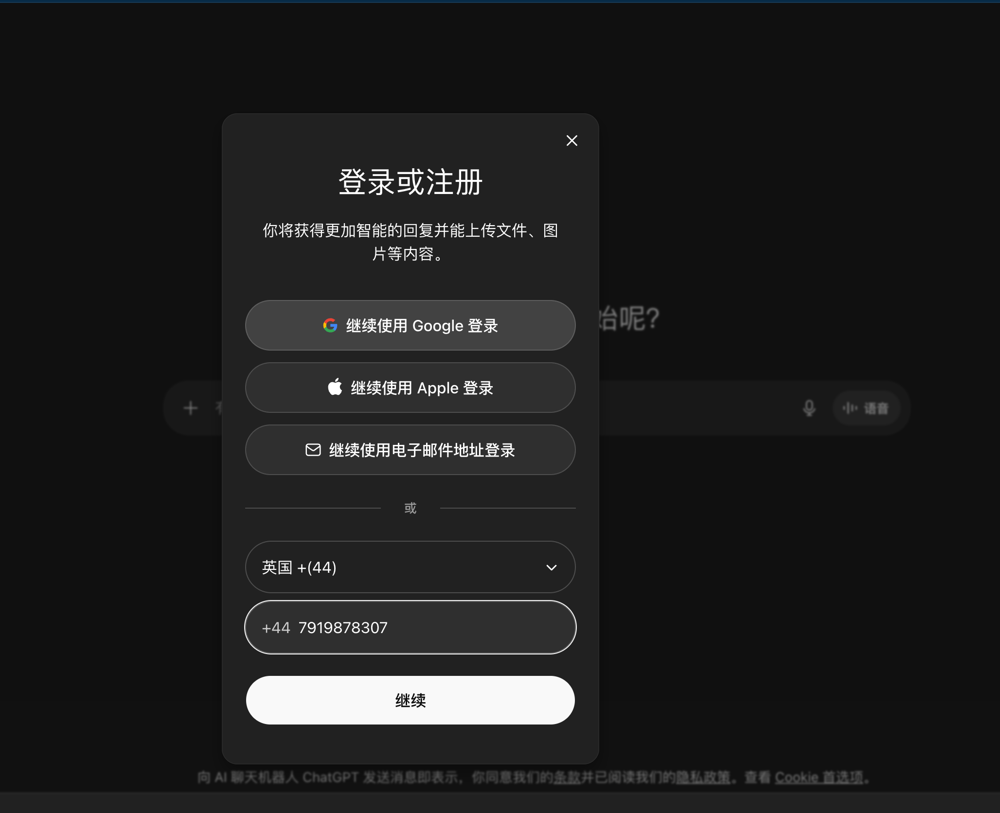
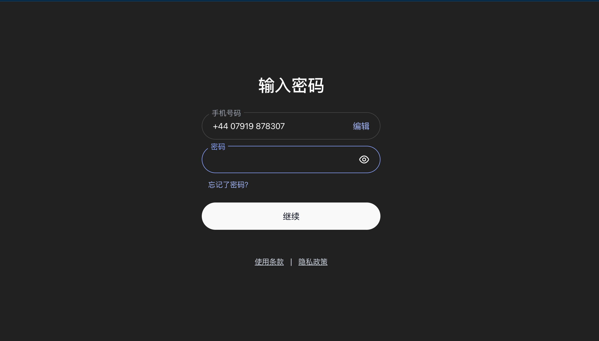
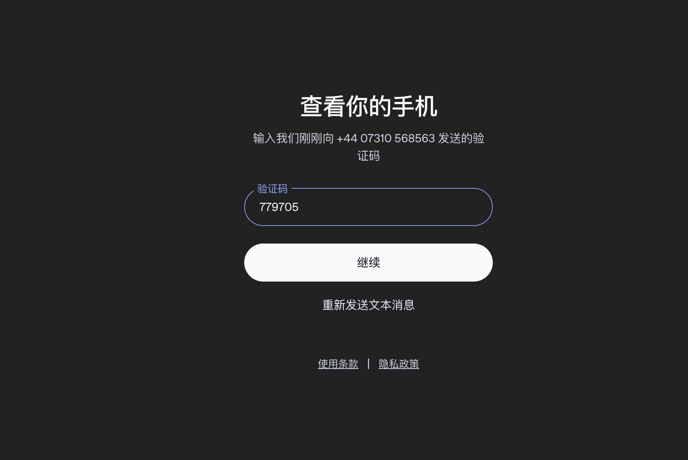
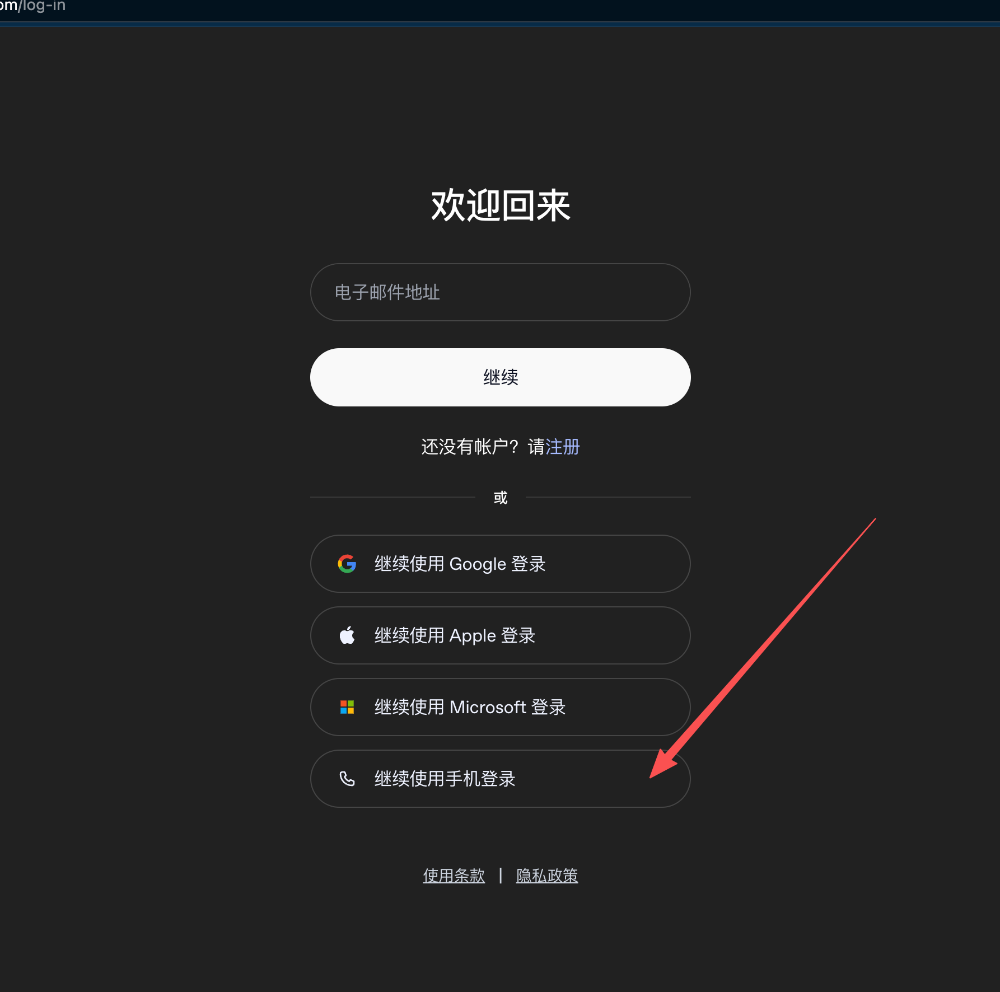
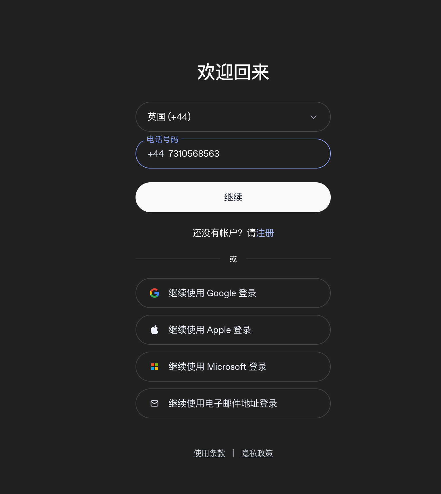
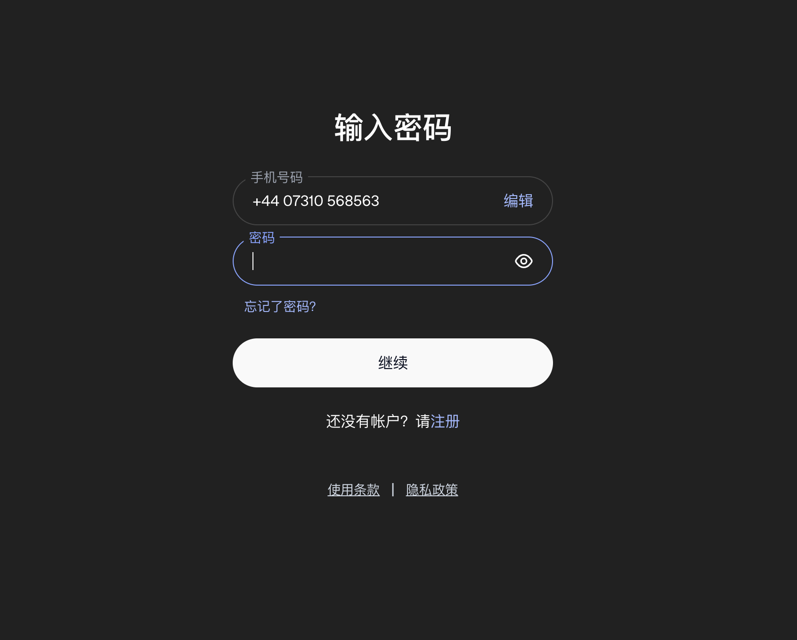
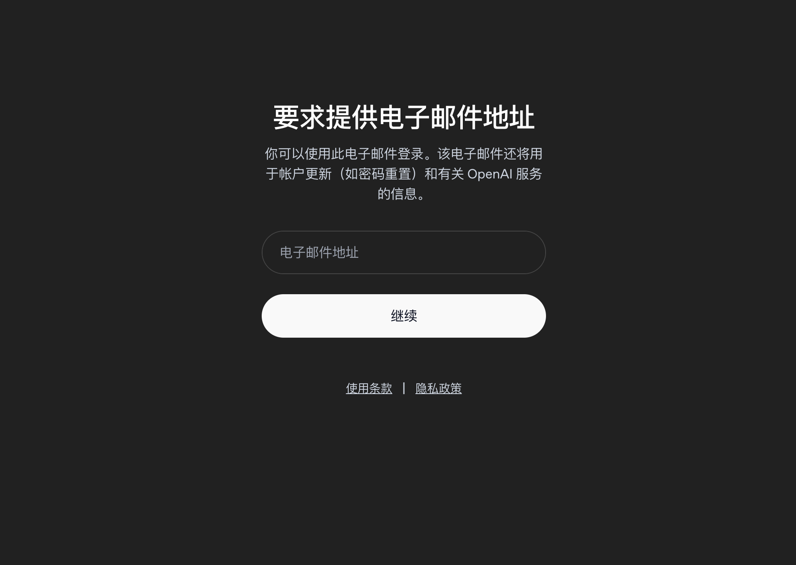
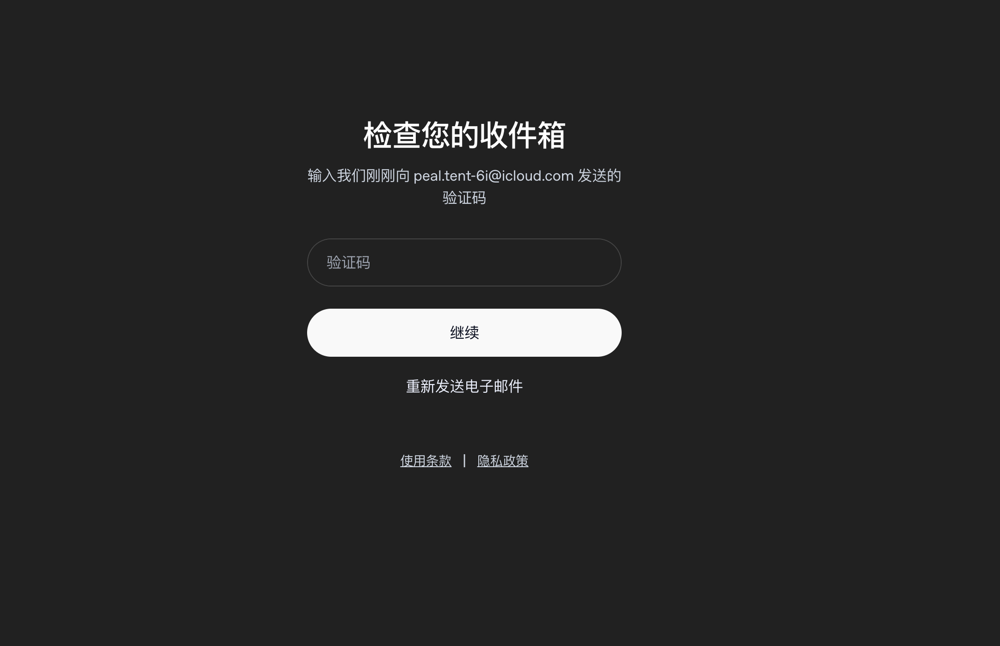

## 步骤说明

### Step 1: Open ChatGPT
- 打开 `https://chatgpt.com/`
- 确认官网首页或注册入口弹窗已经可操作

### Step 2: Signup + phone number!

通过 `content/signup-page.js`：

- 在官网首页查找 `免费注册 / Sign up / Register / 创建账户`
- 自动点击进入注册流程 (https://auth.openai.com/log-in-or-create-account)
- 在页面查找 `手机登录 / 继续使用手机登录`
- herosms接码(我选的英国) 得到手机号后
- 自动填写手机
- 点击 `继续`
- 等待真实落地页；进入 `https://auth.openai.com/create-account/password` 时继续 Step 3

### Step 3: Fill Password

- 使用第 2 步已经确定好的邮箱
- 使用自定义密码或自动生成密码
- 在密码页填写密码并提交注册表单
- 后台会在真正把 Step 3 记为完成前，再确认页面是否已经推进；如果此时出现认证页 `重试` 页面，或 `/email-verification` 上的 `405 / Route Error` 重试页，会先通过共享恢复逻辑最多自动点击 5 次 `重试` 尝试恢复，再继续后续链路
- Step 3 收尾阶段如果页面切换导致旧内容脚本失联，后台单次消息等待不会再卡住超过当前收尾预算；若最终仍未恢复，则会输出中文的步骤级错误，而不是直接暴露底层英文通信超时

实际使用的密码会写入会话状态，并同步到侧边栏显示。

### ### Step 4: Get Phone number verification Code https://auth.openai.com/contact-verification

- 使用现有herosms相关api获得验证码后
- 填入验证码
- 点击 `继续`

### Step 5: Fill Name / Birthday

随机生成人名与生日。

当前脚本支持两种页面结构：

- 页面要求 `birthday`
- 页面要求 `age`

如果页面是生日模式，会填写年月日；如果页面上存在 `input[name='age']`，则直接填写年龄。
如果资料页出现顶部“我同意以下所有各项”总勾选框，脚本会优先自动勾选，再点击 `完成帐户创建`。
点击 `完成帐户创建` 后，Step 5 会立刻记为完成，不再等待页面跳转结果；自动运行在进入 Step 6 前只会等待当前页面加载完成，不再接管 ChatGPT 跳转或 onboarding 跳过逻辑。

### Step 6: Clear Login Cookies

这一步只负责登录前清理环境：

- 开始前先等待 10 秒
- 直接删除 `chatgpt.com / openai.com` 相关 cookies
- 必要时再用 `browsingData` 补扫一次

把 cookies 清理独立成单独步骤后，后续登录链路的重开锚点就不再落在这里。

### Step 7: Login via OAuth

这一步会重新获取一遍最新的 CPA OAuth 链接，再使用刚注册的账号登录。

当前 Step 7 的完成标准不是“邮箱/密码已提交”，而是：

- 已刷新到最新 OAuth 链接
- 认证页已经真正进入登录验证码页面
- 在真正把 Step 7 记为完成前，还会再做一轮收尾确认；如果页面只是短暂进入登录验证码页、随后又掉进登录重试页，则不会直接进入 Step 8，而是先按共享恢复逻辑处理并重跑 Step 7
- 如遇登录超时报错，会先尝试通过共享恢复逻辑最多自动点击 5 次认证页上的 `重试` 恢复当前页面；若仍未恢复，再按既有逻辑重跑整个 Step 7
- 如遇登录页长时间停滞，会由后台刷新 OAuth 后重跑整个 Step 7
- 如果重试页内容中出现 `max_check_attempts`，会立刻完全停止流程，并在侧边栏复用现有确认弹窗提示这是 Cloudflare 风控拦截，确认按钮显示为“我知道了”
- Step 8 不负责替代 Step 7 的收尾确认；它默认消费的是“已经由 Step 7 确认稳定进入”的登录验证码页，只在后台入口做防御性状态兜底

支持：

- herosms的api使用setStatus(3)
- 手机号登录
- 在页面查找 `手机登录 / 继续使用手机登录`
- 使用Step 2获取到的手机号 自动填入
- 点击 `继续`
- 输入Step 3设置好的密码
https://auth.openai.com/add-email

### Step 8: add email

- 根据现有email功能的api获得email
- 填入email
- 点击 `继续`
- 根据 `Mail` 配置，轮询邮箱并提取 6 位验证码。
- 进入邮箱轮询前，脚本会先确认认证页是否已经进入验证码页面；如果注册认证流程出现 `糟糕，出错了 / 操作超时（Operation timed out）`，或 `/email-verification` 上的 `405 / Route Error` 且带有 `重试` 按钮，会先通过共享恢复逻辑最多自动点击 5 次 `重试`，必要时回到密码页重新提交，再继续等待验证码页面。
在 `Auto` 模式下，如果 Step 4 当前轮失败，后台不会立刻丢弃这轮邮箱；而是沿用当前邮箱回到 Step 1 重新开始当前轮，避免刚拿到的邮箱被直接换掉。
但如果 Step 4 的认证重试页正文里出现 `user_already_exists`，则会直接判定“当前用户已存在”，不会点击 `重试`，而是立即结束当前轮；开启自动重试时会直接继续下一轮。

- 支持但不限于：
- `Hotmail`（远程服务 / 本地助手）
- `iCloud` 收件箱，或 iCloud Hide My Email 转发到 QQ / 163 / 163 VIP / 126 / Gmail 后收码
- `content/qq-mail.js`
- `content/mail-163.js`（163 / 163 VIP / 126）
- `content/inbucket-mail.js`

邮件匹配规则以以下关键词为主：

- 发件人：`openai`、`noreply`、`verify`、`auth`、`duckduckgo`、`forward`
- 标题：`verify`、`verification`、`code`、`验证`、`confirm`

### Step 9: Manual OAuth Confirm

严格回调捕获规则：

- 步骤 9 现在只接受 `http(s)://localhost:<port>/auth/callback?code=...&state=...` 或 `http(s)://127.0.0.1:<port>/auth/callback?code=...&state=...`
- 监听范围只限于当前 OAuth 认证标签页的主 frame 跳转
- 普通 `localhost` 页面，包括本地部署的 CPA 面板，不会再被误判为回调地址

虽然按钮名称还是 `Manual OAuth Confirm`，但当前代码已经做了自动尝试：

- 在授权页定位“继续”按钮
- 等待按钮可点击
- 获取按钮坐标
- 通过 Chrome `debugger` 的输入事件点击该按钮
- 点击后会持续检查页面是否真正离开当前状态；如果点击后出现认证页 `重试` 页面，则直接报错，不会在 Step 9 内部点击 `重试`
- 同时监听 `chrome.webNavigation.onBeforeNavigate`
- 一旦捕获本地回调地址，就把结果保存到 `Callback`

注意：

- 这一步仍然是最容易因页面变化而失效的一步
- 如果 120 秒内没有捕获到 localhost 回调，会报错超时
- README 中的按钮名称沿用了旧文案，但代码行为是“自动尝试点击”

### Step 10: CPA Verify

校验规则：

- 步骤 10 会拒绝任何不是真实 `/auth/callback`，或缺少 `code` / `state` 的本地回调地址
- 成功后的清理只会针对 `/auth` 这一类真实回调标签页，不会再泛化清理任意 localhost 路径
- 侧边栏可切换“回调方式”，默认是 `服务器部署`
- 选择 `服务器部署` 时，即使 CPA 部署在本地，也会执行步骤 10
- 选择 `本地部署` 时，仅当本地 CPA 且步骤 9 已拿到回调地址时，才会直接跳过步骤 10

回到 CPA 面板：

- 自动填写 localhost 回调地址
- 自动点击“提交回调 URL”
- 必须等到 CPA 面板出现精确的 `认证成功！` 状态徽标后，才判定成功
- 成功后会自动关闭匹配 `http://localhost:1455/auth` 这一类前缀的 localhost 残留页面